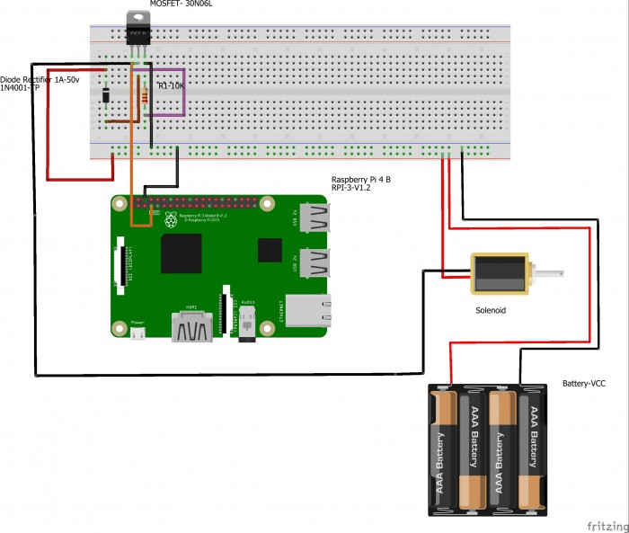

# Solenoid (PingPong Machine)
## Created by: Sahil Sahil
-------------
## Humber Institute of Technology and Advanced Learning
## CENG 317 Instructor: Kristian Medri

## Table of Contents
* [Introduction](#introduction)

* [Parts Required and Budget](#Part-Required-and-Budget)

* [Time Commitment](#time-Commitment)

* [Setting up Raspberry Pi](#setting-Up-Raspberry-Pi)

* [Hardware Testing](#hardware-Testing)

* [Assembling ](#assembling)

* [Soldering ](#Soldering)

* [Enclosure](#Enclosure)

* [Testing](#testing)

* [Production-Testing](#Production-testing)

* [Final Product](#final-product)

#

## Introduction

Solenoid is the generic term for a coil of wire used as an electromagnet. It also refers to any device that converts electrical energy to mechanical energy using a solenoid. The device creates a magnetic field from electric current and uses the magnetic field to create linear motion.

#

## Part Required and Budget

The Parts Required for the project -:

* [Raspberry Pi 4B Kit](https://www.amazon.ca/Raspberry-Pi-Computer-Model-4GB/dp/B07W4JM192/ref=sr_1_4?crid=38D5SW1ETTEZ5&keywords=raspberry+pi+4&qid=1576171042&sprefix=ras%2Caps%2C251&sr=8-4) - CAD$100.05
* [Solenoid](https://www.amazon.ca/gp/product/B00LBQ229Y/ref=ppx_yo_dt_b_asin_title_o04_s00?ie=UTF8&psc=1) - CAD$20
* [Transistor IRL 520N](https://www.amazon.ca/CanaKit-Raspberry-Complete-Starter-Kit/dp/B01CCF6V3A/ref=sr_1_5?s=pc&ie=UTF8&qid=1516324581&sr=1-5&keywords=Raspberry+Pi+3) - CAD$15
* [Diode 1N4001-TP](https://www.amazon.ca/gp/product/B008UG13UW/ref=ppx_yo_dt_b_asin_title_o04_s00?ie=UTF8&psc=1) - CAD$10
* [Resistor 2.2k/300 ohm](https://www.amazon.ca/ELEGOO-Values-Resistor-Assortment-Ohm-1M/dp/B071HJWJZB/ref=sr_1_8?crid=5U1W9IPQ0MI2&keywords=resistor+kit&qid=1576171176&s=hi&sprefix=resistor%2Ctools%2C180&sr=1-8) - Price depends on You

#

## Time Commitment
This project can be done in one weekend. It will take about 2 to 4 days to recieve the parts. If you want to skip breadboarding then you can get started with the soldering which would take about 10 minutes but testing can take about 2 hours. After getting address, it should take one more hour to run the python script and get the readings.

#

## Setting up Raspberry Pi
First step after getting your raspberry pi is to set it up. Follow the steps below:(I Used Ethernet Cable to Connect to pi By RDP)
1. Download [Raspbian](https://www.raspberrypi.org/downloads/) to be installed on your raspberry pi.
2. Use [SDCardFormatter](https://www.sdcard.org/downloads/formatter_4/) to format your SD card and flash downloaded OS on your SD card.
3. Insert SD card in raspberry pi 
4. Download [Xming](https://sourceforge.net/projects/xming/) software into your PC and run
5. connect your raspberry pi to Laptop or Pc by ethernet cable or connector
6. Open putty Typing "raspberrypi.mshome.net" or the "Ip address" of pi which you can get by running advance ip scanner.
4. Add when you open the terminal you see your pi running.

#

## Hardware Testing

After software installation, i made the connections using jumper wires from sensor to breadboard and breadboard to raspberry pi.

Wiring:
---
- Raspberry Pi PIN 3 to as Ground
- Raspberry Pi GPIO 11 to solenoid

### Circuit
This wiring diagram could be helpful to make the connections on breadboard

