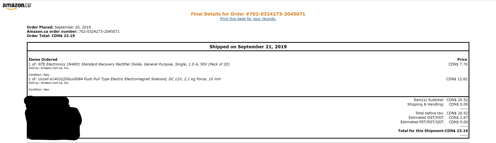
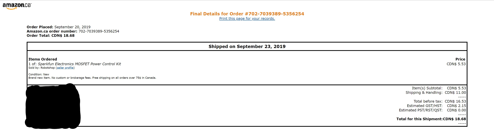
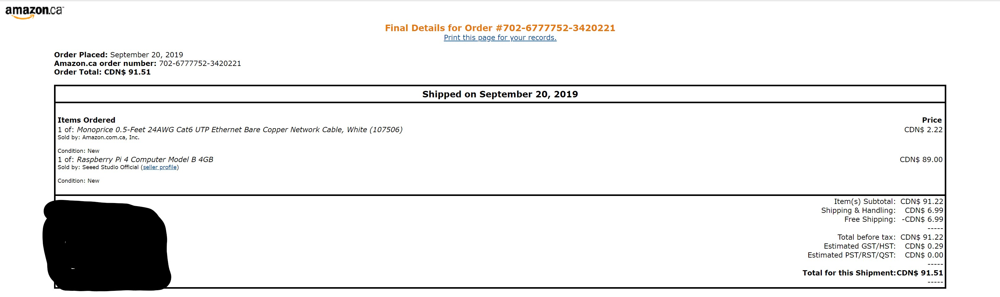

Solenoid/Ping-Pong
---

---

Solenoid/TennisBall Blog.
-------------

### December 12, 2019
### Final Update
My project is completed and approved by teacher.

.jpg?raw=true)
.jpg?raw=true)
Without solenoid connected

### December 11, 2019
### Update on PCB and Project
PCb is working now and i'm able to handle the all the current which solenoid was throwing before.

.jpg?raw=true)

### November 28, 2019
#### [Presentation](https://github.com/Sahil-Sahil/TennisBall/blob/master/Documentation/Ping%20Pong%20Machine.pptx)
Presentation for the Project

### November 20, 2019
#### Update on PCB
My Power-tool kit to control the power got short out and now i have to re-order it. I received it on 26 November.

### November 15,2019
[3-d Print Enclosure base .cdr file](https://github.com/Sahil-Sahil/TennisBall/blob/master/Mechanical-3D%2C%20Printing%20Files/Enclosur.cdr)

### October 30, 2019
I have Written the [Program](https://github.com/Sahil-Sahil/TennisBall/blob/master/Firmware-Sensor%2C%20Effector%20Intertface%20Code/solenoidP.py) in python to run solenoid and its working
Connection with raspberry pi and pcb are done and they are also  Working and my solenoid is Running.

### October 10, 2019
#### Fritzing File
This is the link to my [Fritzing File](Electronics-PCB/STennisBall.fzz)

#### My Breadboard Design
.jpg)

#### My Circuit Schematics

#### My PCB design
.jpg)

### October 05, 2019
My development platform has arrived.
My motors driver has arrived.

### September 26, 2019
Budget for the [Project](https://github.com/Sahil-Sahil/TennisBall/blob/master/Documentation/Budget%20Due(Sahil).pdf).

Proof of Budget
.
.
.

### September 20, 2017

Project Schedule Created [project schedule](https://github.com/Sahil-Sahil/TennisBall/blob/master/Documentation/Ghantchart.pdf).  

### September 13, 2017

Proposal Created [proposal](https://github.com/six0four/StudentSenseHat/blob/master/documentation/ProposalContentStudentNameRev02.pdf).

### September 6, 2017

Created [repository](https://github.com/Sahil-Sahil/TennisBall). 
